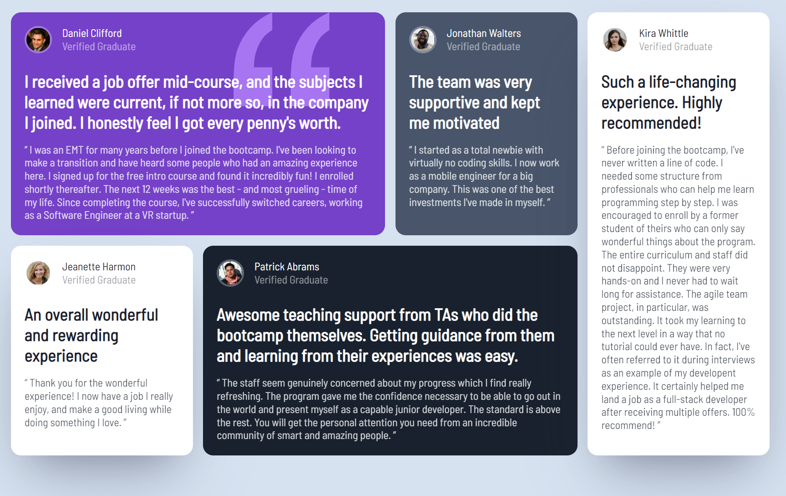

# <a href="https://satrop.github.io/Grid_Layout_Testimonials/public/">Frontend Mentor - Grid Layout Testimonials solution</a>

This is a solution to the [QR code component challenge on Frontend Mentor](https://www.frontendmentor.io/challenges/qr-code-component-iux_sIO_H). Frontend Mentor challenges help you improve your coding skills by building realistic projects.

### Screenshot

 

  

First real time using the grid and I really like it! There is a mix of both grid and flexbox in this. Both have great uses!

### Links

-   Solution URL: <a href="https://satrop.github.io/Grid_Layout_Testimonials/public/">Grid Layout Testimonials</a>

## My process

### Built with

-   HTML
-   SCSS with custom properties
-   Grid
-   Flexbox
-   Mobile-first workflow

### What I learned

Learned how much easier it is to <code>grid-template-areas</code> that I thought it was!.

### Continued development

For my future projects I'm want to be practising React / TypeScript and Pure JS.

